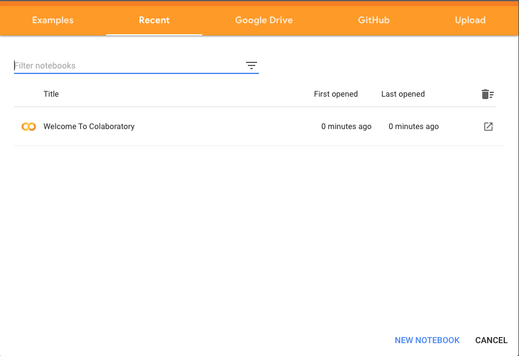
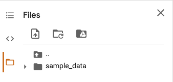
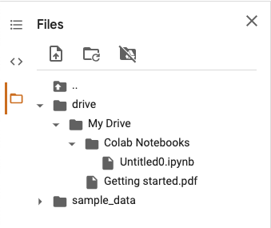

# How to Use Colab
1. Go to https://colab.research.google.com/
2. Click New Notebook.

    
3. Click Mount Drive icon(third icon at the bottom of the `Files`).

    

4. Then you can see this screen.

    

